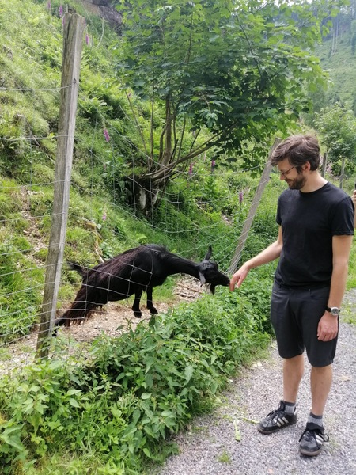
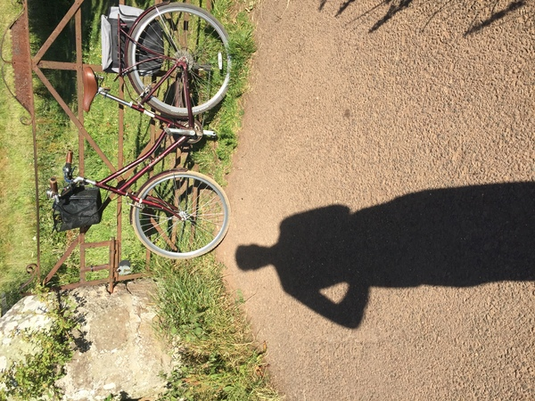
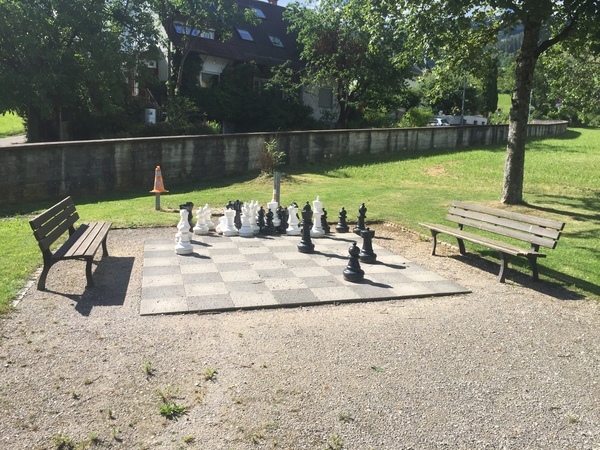

---
title: Photos
motp: of and/or by rwl. Try 'think'.
...

# Photos {#photolist data-tocd="all photos"}

## of rwl {#of data-tocd="rwl"}

{#think}

{#frege}

{#liar}

{#goat}

## by rwl {#by data-tocd="rwl"}

{#bike}

{#chess}

