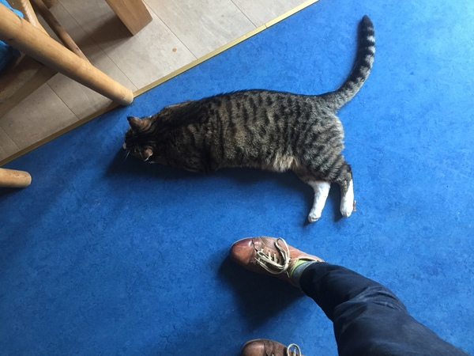
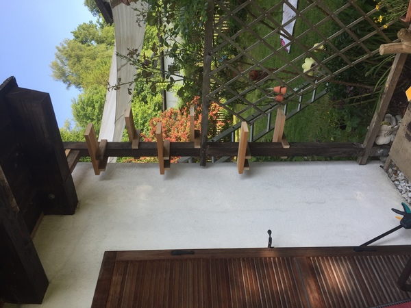
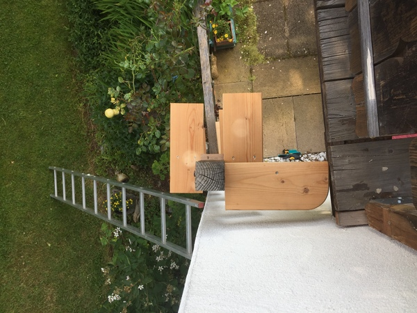
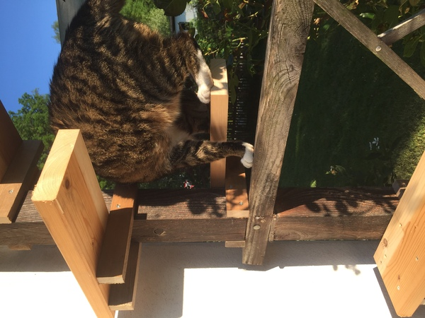
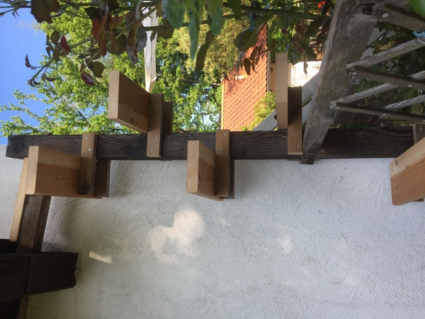
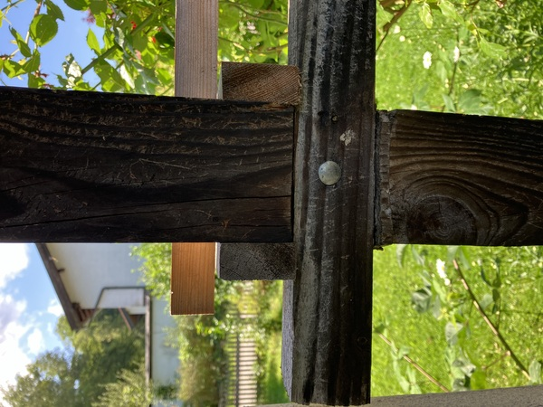
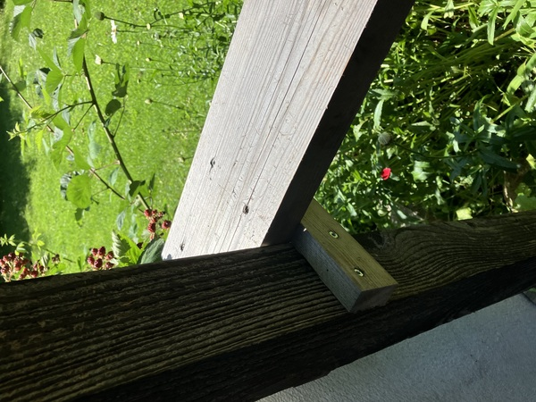
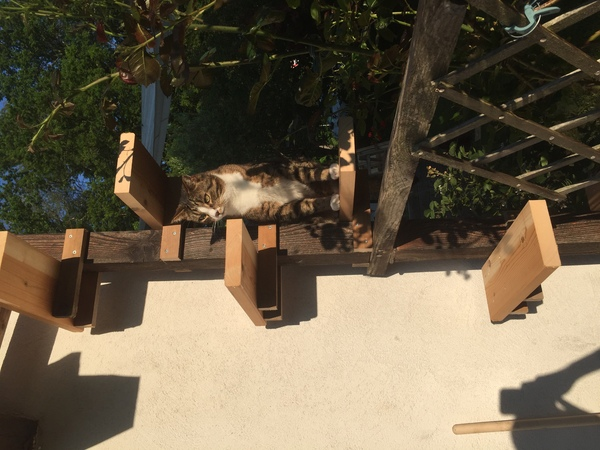

This is Findus:

{#findus}

Findus is a cat. He is a cat of a certain age, who lives alone with
his adopted grandmother. He is also the one true love of my partner.
When we count up the photos she has of me vs. him, he usually wins. I
like Findus, but I don't really have much choice, because otherwise
there would be Consequences for the Relationship.

Findus is getting on in years and growing out in girth and has some
back problems. Since he is an outdoor cat, he needs a way to come and
go at will, and his previous way of doing this seemed to be hurting
his back. Since his grandmother is not always home, or awake even when
she is, she also needs a way to let him out and it that doesn't involve
leaving a ground floor entrance open.

So we decided to remedy this situation. In June 2023, we built him a
cat ladder. We are [not the first people to do
this](https://brigitteschuster.com/swiss-cat-ladders "Swiss Cat
Ladders, by Brigitte Schuster").

We built him a cat ladder up to a second-floor balcony, where there is
a door that can be left open for him to come and go as he pleases.
It looks like this:

{#finished}

My partner spent a while looking at designs on the Internet, of which
there are *many*. But given the constraints of space and the material we had
to work with, we decided for a simple alternating-side design that
allows Findus to snake up and down to the balcony like a champ.

{#above}

{#testing}

The step design is pretty simple: each step is screwed to a couple of
joists, which are themselves screwed to an existing post standing
between the porch and the balcony.

{#steps}

There isn't enough room behind the post for a cat (or to drive screws
without a special angled head), so we set the steps asymmetrically,
with most of the surface away from the pole and the wall. We thought
about angling the joists or otherwise reinforcing the joint, but even
a heftier cat does not weigh that much and so we kept things simple.

If we were building this again with fewer constraints, we might put
more space between the steps, because Findus seems a little cramped,
but it would have been tricky. There is a rail attached to the post
about midway up which gets in the way of the alternating design, and a
different spacing would have made it awkward for him to get around it.

{#rail}

Nevertheless, a year later, there are plenty of scratches on the
steps, showing it's been seeing good use:

{#scratches}

And here's our hero on the day of construction, posing like he made
the thing himself:

{#aww}

That's 3-0 to you, Findus, just in this post.
