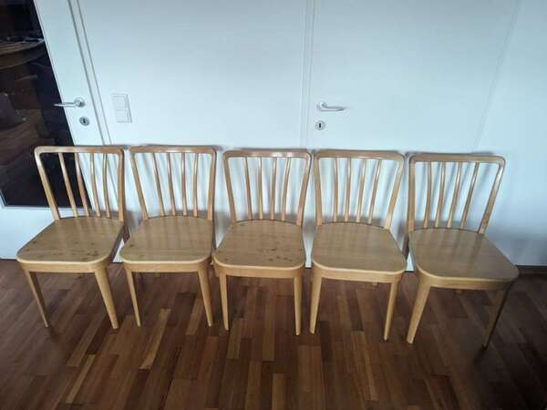
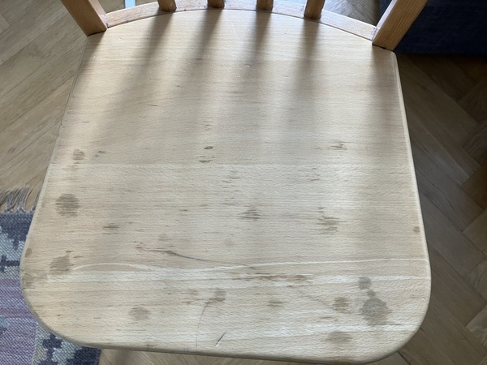
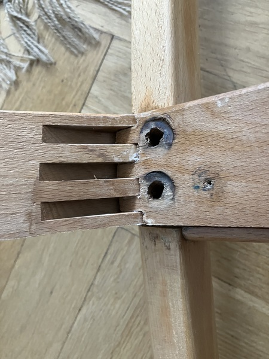
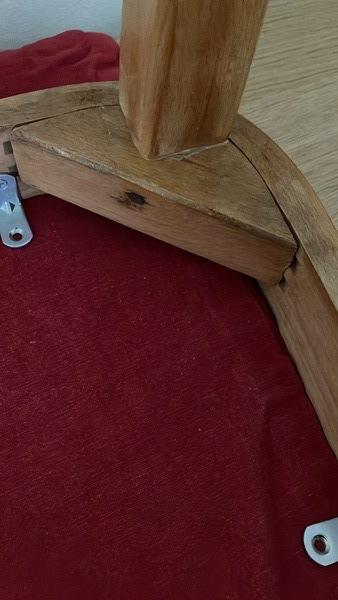
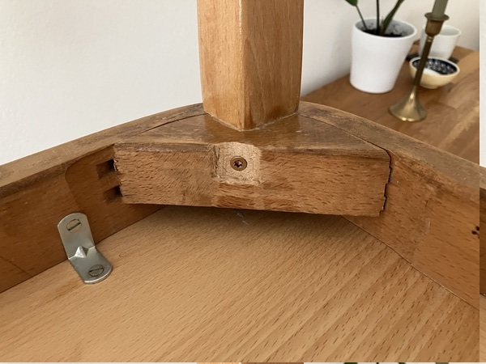
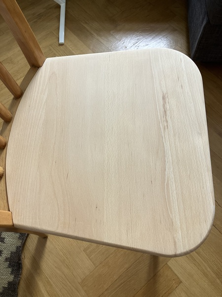

# The chairs

I bought some chairs recently. According to the family I bought them
from, they are already about 120 years old, and were originally from a
restaurant.

Some of them were in rough shape. Someone had already replaced all the
seats at some point, but even the new seats were scratched up. Three
of them also had spots which were apparently caused by a caustic
cleaning solution that dripped onto them when someone was cleaning a
ceiling after a fire. And most were rickety.

Nevertheless, the sellers highlighted the "old carpenter things" and
the chairs were fundamentally sound. I needed chairs so I bought them
and set about restoring them.

# Regluing the joints {#regluing}

The chairs were rickety because the glue in the joints was no longer
holding them. 

[I followed the advice in this video](https://youtu.be/XSVGLTpCMHo?si=x5zsuxnzyNGIOcAo "How to repair
loose chairs @ Youtube") to take them apart and reglue the joints.

## The back {#back data-tocd="frame joint"}

The frame of the seat is made from just two pieces: one long bent
pieces that wraps around the front legs, and one short piece that
joins the two ends at the back. The short piece is joined to the long
piece with a triple mortise-and-tenon joint.

The seat frame is fixed to the back of the chairs by four bolts. The
holes for the bolts were drilled right through the joints, which
significantly weakened the tenons in a few places. A couple of the
tenons have broken as I took the frames apart. For now I've just
reglued all pieces into place, but if they become rickety again
quicky, I'll have to replace at least the back side of the seat
frames.

This project has made clear to me how important leverage is in
woodworking. I could pull the legs of the chair and see the back piece
moving in the joint, so I knew it needed to be reglued. But once I
took the legs off, the joint still seemed very tight; without the
leverage of the legs, I couldn't move it with my hands. Yet when
someone sits in the chair, the legs provide this leverage,
transferring the weight of the seated person (at least partly) to the
joint. So the joint has to be strong.

## The front legs {#front data-tocd="legs"}

At the front of the chair, the legs are doweled into a couple of
triangular cross pieces which are themselves glued into the frame with
a mortise-and-tenon joint.

The original carpenter drove a nail through the cross piece into the
doweled part of each leg. This was a nice touch that prevented the
dowels from rotating in their sockets.

Unfortunately, it meant I had to pull the nails in order to pull the
legs out. This turned out to be a challenge with 120 year old nails.
In the end I had to chisel out around the nails before I could get
enough leverage on them to remove them.

I replaced the nails with screws, which will hopefully make this
repair easier the next time it's needed. I didn't bother to pretty up
my chisel job, though.

# Refinishing the seats {#refinishing data-tocd="the seats"}

The seats have been straightforward to restore. Sand off the lacquer
and the flecks and the scratches, apply new finish. Some of the spots
from the cleaning solution were surprisingly deep.

# The result {#result}
