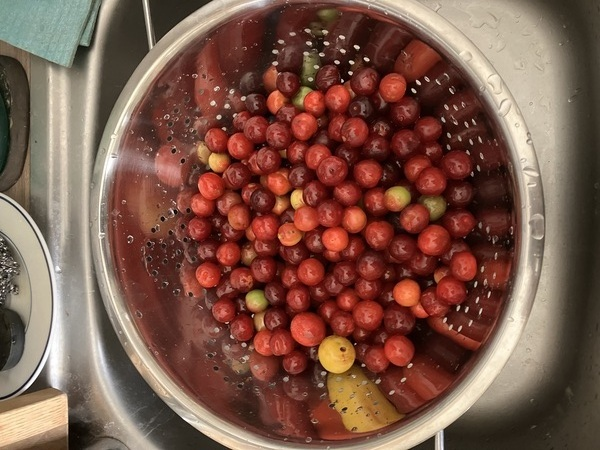
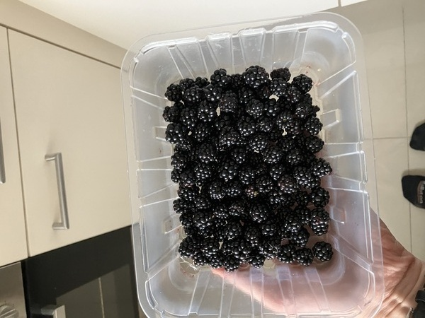
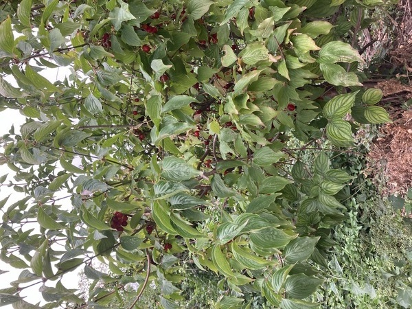
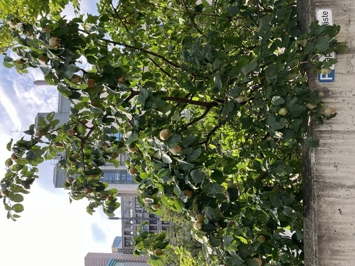
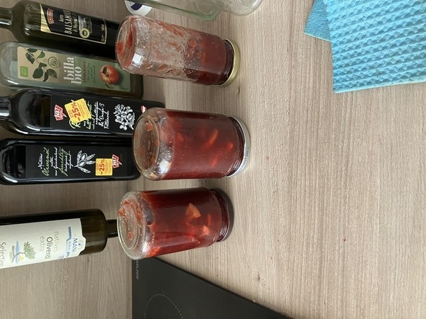
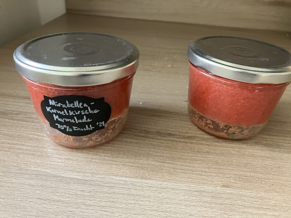

This summer I've been busily gathering fruit from trees and bushes
around Vienna, which I have often found via [mundraub.org](https://mundraub.org),
a website for mapping edible plants in the German-speaking world.

There's something primeval about this. Here I am, an ape using a stick
to shake fruits from a tree so I can eat them with my long wispy
fingers. Here I am, using those same fingers to find the sweet morsels
hidden behind the thorns on a bush. Just being aware of the
possibilities has changed my perception of the natural world in the
city: now I notice fruit trees and bushes and identify them quickly,
and when I see signs of fallen fruit on the asphalt, I stop and look
up. And I'm not alone: sometimes I see other people gathering food,
especially in the Prater; other times I see the sticks they leave
behind for others to use. It feels like being part of a tiny secret
ursociety, living freely from a shared commons, hidden in the cracks
of modern capitalism.

# Fruit

Already in July, I've had a lot of luck gathering plums, blackberries,
and [Kornelkirschen]{lang="de"} (apparently known as ["Cornelian
cherries"](https://en.wikipedia.org/wiki/Cornus_mas) in English,
though they aren't true cherries).

{#plums}

{#blackberries}

{#cornelians}

{#corneliantree}

{#quincetree}

# Making jam

I have mostly been making jam from the fruit that I don't eat
directly. So far in 2024 I've made jam with:

1. [Kirschpflaumen](https://de.wikipedia.org/wiki/Kirschpflaume):

   {#plumjam}

1. [Mirabellen](https://mundraub.org/mirabelle-steckbrief) and [Kornelkirschen](https://mundraub.org/node/82098):

   {#cornelianjam}

1. [Zwetschgn](https://bar.wikipedia.org/wiki/Zwetschgn) (that is a
   link to *Bavarian* Wikipedia(!); [see here for
   Hochdeutsch](https://de.wikipedia.org/wiki/Zwetschge)), though alas
   I did not find any public Zwetschgn trees this year, and ended up
   buying them

I missed out on [Mulberries](https://mundraub.org/maulbeere-steckbrief) this year,
but I've just harvested some [Quinces](https://mundraub.org/quitte-steckbrief)
I've had my eye on and will make jam from them soon.

I also made a [red sauce](./hagebutten-sauce.html) from
[rose hips](https://mundraub.org/hagebutte-steckbrief) as a
replacement for tomato sauce.

## The pits

One big disadvantage of fruit trees on public land is that the fruit
is generally smaller and there are therefore many more seeds to remove
for a given quantity than with farm-raised fruit, and they're often
"cling fruit" which hasn't been bred so that the stone comes out
easily. I've tried various things, with varying degrees of success. I
bought a ["Flotte Lotte" (food
mill)](https://www.youtube.com/watch?v=bvadL-IeOy8) at a thrift store,
but unfortunately it doesn't work well with larger fruit stones like
in plums; the clearance is too low for anything much bigger than an
apple seed and isn't adjustable. Breaking the fruit up with my
electric mixer seemed like a good idea but it just made a (dangerously
hot) mess, even on the lowest setting. Picking the seeds out with a
combination of a big slotted spoon and a small teaspoon works alright
with plums, but becomes far too tedious with something like
Kornelkirschen.

The best method I've found so far is to cook the fruit for a while,
then pile the mixture all into a sieve and use a slotted spoon to
churn it around and force it down into the sieve, which sort of
replicates the food mill manually. Whatever goes through the sieve or
comes up through the spoon can go directly back into the pot;
eventually the seeds get rubbed pretty clean and left in the middle.
But this method is still a fair amount of work.

## Sugar and acid content {#sugar data-tocd="balancing with acid"}

I've been struggling a bit with getting the right mix of fruit and
sugar. A sufficiently high sugar content is apparently important as a
preservative. But every time I've made jam, I find that the pure
cooked fruit has a lovely acidity that just completely disappears once
the recommended amount of sugar has been mixed in. Many recipes
recommend adding lemons or lemon juice to recover the acidity, which
is what I've been doing, but this seems backward to me and doesn't
really replace the taste that was lost. If anyone has better ideas
that don't involve keeping all of my jam in a refrigerator, please let
me know.

# Mundraub

Mundraub.org itself seems to be languishing a little. There were lots
of gathering points mapped between about 2010 and 2019, including
entries made by the City of Vienna itself. But the quality of the data
is now just OK, in my experience. Some of the plants have died or been
removed in the meantime; some have grown to the point where they are
too tall for harvesting fruit to be practical. It's a gamble whether
you'll find anything when you visit a new tree.

There's also no obvious way to download the data into any other
mapping application, which makes it less useful if you want, say, to
pull up cycling directions to a particular tree on a smartphone. The
website works fine on a smartphone, including as a progressive web
app, but it could use a bit of polish: fat fingers sometimes make it a
chore to switch the various plant types on and off, the zooming level
doesn't stay put after clicking on a mapped plant, and it's not
possible to search with free form text (e.g. to find different
subspecies of plums based on the comments, since Mundraub lumps them
all together). If anyone from the site reads this and wants some help
with these things, write to me!
